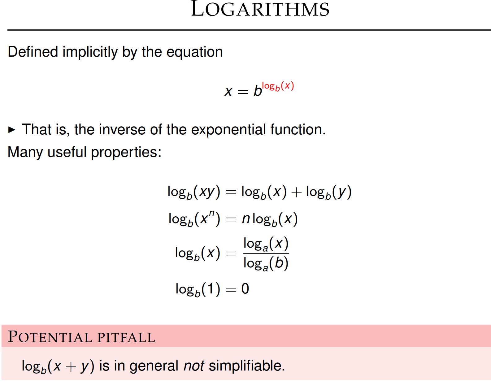

# Total

**Entropy**

▶ Entropy of discrete distributions is non-negative

Entropy is additive for independent random variables.

The goal of experiments is to reduce uncertainty about something.

• The value of a parameter, the best model for some dataset, etc

**Entropy is the optimal bound of the entropy**

**Symbol Coding**

### No free lunch theorem

### Lossy and lossness compression

Even if the code is invertible, it might be hard to decode

It also hold for uniquely decodable code

### KL divergence is a convex down function, so it have a localbal unique minimum

**Mutual Information**

**Channel Coding**

each channel can only transmit one symble at one time (not the entire code word). p(s) means the probability of any speicific message.

”Faster code” means higher transmission rate.

**Probability Inference**

power is like ability to not miss a discovery

**Bayesian Hypothesis Testing**

Estimating Information

Apply to discrete data

